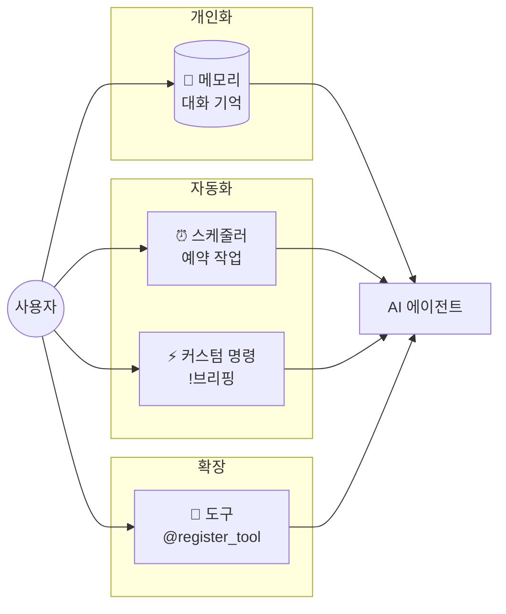
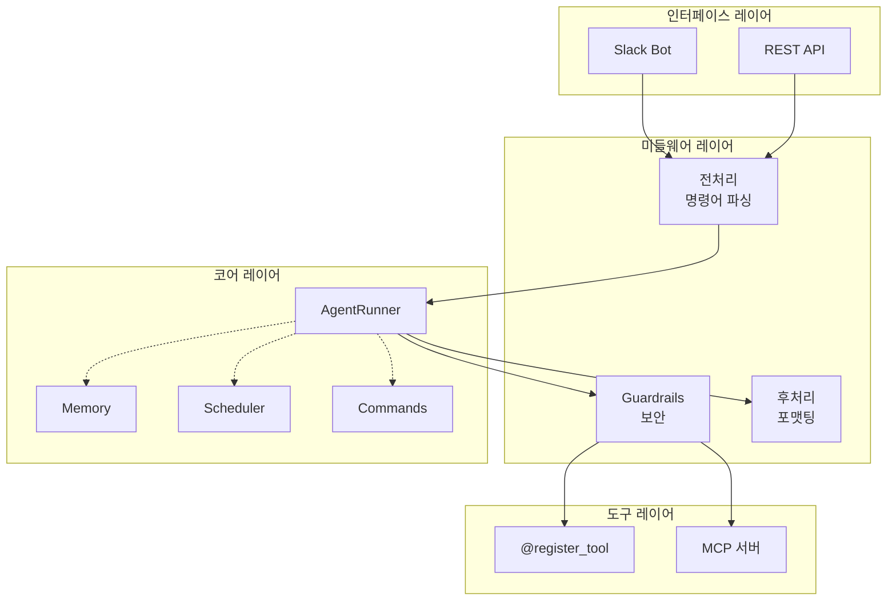

> **[English](README.md)** | 한국어

<p align="center">
  
</p>

<h1 align="center">Sidekick</h1>

<p align="center">
  <em>A personal AI agent that remembers you, schedules tasks, and extends with custom tools.</em>
</p>

<p align="center">
  
  
  
  
  
</p>

---

## 왜 만들었나

범용 AI 챗봇은 매번 같은 맥락을 반복 설명해야 하고, 할 수 있는 일이 정해져 있다.

**Sidekick은 다르다** — 나를 기억하고, 시키면 알아서 실행하고, 필요한 기능은 함수 하나로 붙인다.

| 범용 챗봇 | Sidekick |
|-----------|----------|
| 매번 같은 설명 반복 | 이전 대화, 프로젝트, 선호 스타일을 기억 |
| 실시간 대화만 가능 | "1시간 후에 알려줘" 예약 작업 |
| 고정된 기능 | `@register_tool` 하나로 도구 추가 |
| 프롬프트 직접 입력 | `!브리핑` 커스텀 명령어 |

## 빠른 시작

### 원클릭 설치

```bash
curl -fsSL https://raw.githubusercontent.com/lee-lou2/sidekick/main/install.sh | bash
```

### 수동 설치

```bash
git clone https://github.com/lee-lou2/sidekick.git
cd sidekick
cp .env.example .env  # GOOGLE_API_KEY 설정
make run              # 설정 + 모드 선택 + 실행
```

> `make run` 하나로 uv 설치, 의존성, 실행 모드 선택까지 자동 처리됩니다.

### 실행 모드

**Slack 봇:**
```bash
uv run python src/interfaces/slack/bot.py
```

**REST API:**
```bash
uv run uvicorn src.interfaces.api:app --port 8000
```

**API 호출 예시:**
```bash
curl -X POST http://localhost:8000/run \
  -H "Content-Type: application/json" \
  -H "X-API-Key: $API_AUTH_KEY" \
  -d '{
    "prompt": "오늘 뉴스 요약해줘",
    "webhook_url": "https://your-server.com/webhook"
  }'
```

## 핵심 기능



### 🧠 메모리 - 대화를 기억하는 AI

```
사용자: 나 요즘 FastAPI로 사이드 프로젝트 하고 있어
에이전트: 어떤 서비스 만들고 있어?

(며칠 후)

사용자: API가 좀 느린 것 같아
에이전트: FastAPI 프로젝트 말하는 거지? 보통 DB 쿼리나 동기 I/O가 병목이야.
         특정 엔드포인트 프로파일링 해볼까?
```

- 이름, 프로젝트, 선호 스타일(반말/존댓말)을 자동 기억
- "기억해" 같은 명시적 요청 없이 자연스럽게 학습
- 사용자별 격리된 메모리 (멀티유저 안전)

### ⏰ 스케줄러 - 예약 작업

```
"1분 후에 오늘 뉴스 요약해줘"
"오후 5시에 회의 준비 알림"
"내일 오전 10시에 이메일 체크해줘"
```

- 한국어/영어 시간 표현 자동 파싱
- SQLite 영속성 - 봇 재시작해도 예약 유지
- `예약 목록 보여줘`, `작업 abc123 취소해줘`

### ⚡ 커스텀 명령어

자주 쓰는 프롬프트를 명령어로 저장:

```
사용자: !브리핑 만들어줘. 프롬프트는 "오늘 주요 뉴스 3개 요약해줘"
에이전트: 명령어 '브리핑' 생성 완료!

(이후)

사용자: !브리핑
에이전트: [오늘의 뉴스 요약...]
```

- AI가 프롬프트를 자동 개선
- 적합한 도구 자동 추천
- 본인이 만든 명령어만 수정/삭제 가능

### 🔧 도구 확장

```python
# src/tools/custom/weather.py
import os
from src.tools.registry import register_tool

@register_tool
def get_weather(city: str) -> str:
    """도시의 날씨를 조회합니다."""
    api_key = os.getenv("WEATHER_API_KEY")
    return fetch_weather_api(city, api_key)
```

**도구 파일 하나만 추가하면 끝.** 다른 파일 수정 불필요.
- 환경변수: `.env`에 추가
- 재시작: `make run`

### 📦 도구 공유 - 업로드 & 설치

만든 도구를 다른 사람과 공유하고, 공유받은 도구를 설치할 수 있다.

**도구 업로드 (공유하기):**
```bash
make tool-upload
```
```
사용 가능한 도구 파일:
  1) exa_search.py
  2) weather.py
번호를 선택하세요: 2

✅ 업로드 완료!
🔗 https://litter.catbox.moe/abc123.py (1시간 후 만료)
```

**도구 설치 (공유받기):**
```bash
make tool-install
```
```
도구 파일 URL: https://litter.catbox.moe/abc123.py
파일명: weather.py

✅ 설치 완료! → src/tools/custom/weather.py
make run 으로 재시작하세요.
```

- 업로드 시 임시 링크 생성 (1시간 유효)
- 설치 시 Python 문법 자동 검증
- `src/tools/custom/`에 자동 배치

## 아키텍처

### 레이어 구조



각 레이어는 명확한 책임을 가진다:

| 레이어 | 책임 | 예시 |
|--------|------|------|
| **Interfaces** | 외부 진입점, 프로토콜 처리 | Slack Socket Mode, FastAPI |
| **Middleware** | 횡단 관심사 | 보안, 전처리, 후처리 |
| **Core** | 비즈니스 로직 | 에이전트, 메모리, 스케줄러 |
| **Tools** | 도구 정의 및 실행 | 커스텀 함수, MCP 서버 |

### 디렉토리 구조

```
src/
├── interfaces/          # 진입점
│   ├── slack/          # Slack (Socket Mode, lazy listener)
│   └── api/            # FastAPI (비동기, 웹훅)
├── middleware/
│   ├── guardrails/     # 보안 - 민감 파일 차단, 쓰기 제한
│   ├── preprocessing/  # 명령어 파싱, 컨텍스트 설정
│   └── postprocessing/ # 응답 후처리 (최소화)
├── core/
│   ├── agent/          # AgentRunner, AgentFactory, utils
│   ├── memory/         # 그래프 기반 사용자 컨텍스트
│   ├── scheduler/      # APScheduler + SQLite
│   ├── commands/       # 커스텀 명령어 CRUD
│   └── lifecycle.py    # 컴포넌트 시작/종료 관리
├── tools/
│   ├── custom/         # @register_tool 도구들
│   ├── mcp/            # MCP 서버 정의 (register_mcp_server, gitignored)
│   ├── mcp_registry.py # MCPServerConfig, ServerGuardrailRules, register_mcp_server()
│   ├── mcp_client.py   # MCPManager (다중 MCP 서버 연결)
│   ├── catalog.py      # 모든 도구 통합
│   └── registry.py     # 자동 등록 로직
└── utils/              # 로깅, 포맷터 등
```

### 설계 특징

| 특징 | 구현 |
|------|------|
| **느슨한 결합** | 플러그앤플레이 도구/MCP 서버 - 파일 추가/삭제만으로 등록/해제 |
| **Defense in Depth** | Guardrails가 MCP + 커스텀 도구 모두 보호 |
| **Lifecycle 관리** | 싱글톤 컴포넌트 시작/종료 순서 보장 |
| **MCP 통합** | filesystem, git, github 등 외부 도구 연결 |
| **Observability** | Pydantic Logfire로 추적 가능 |

## 환경변수

| 변수 | 필수 | 설명 |
|------|:----:|------|
| `GOOGLE_API_KEY` | ✅ | Gemini API 키 |
| `SLACK_BOT_TOKEN` | | Slack 봇 토큰 |
| `SLACK_APP_TOKEN` | | Slack 앱 토큰 |
| `API_AUTH_KEY` | | REST API 인증 키 (미설정 시 인증 비활성화) |
| `GITHUB_TOKEN` | | MCP GitHub 연동 |

코어 환경변수: [.env.example](.env.example) | 커스텀 도구 환경변수는 `.env`에만 추가

## 개발

```bash
make              # 도움말
make test         # 코어 테스트
make test-all     # 전체 테스트 (커스텀 도구 포함)
make lint         # 린트 + 자동 수정
make format       # 코드 포맷팅
make tool-install # 외부 도구 설치
make tool-upload  # 도구 공유용 업로드
make edit-env     # .env 편집
```

상세 가이드: [AGENTS.md](AGENTS.md)

## 제한사항

- 도구 추가 후 재시작 필요
- SQLite 기반 (단일 인스턴스 권장)
- 개인/소규모 팀 용도

## 라이선스

MIT
