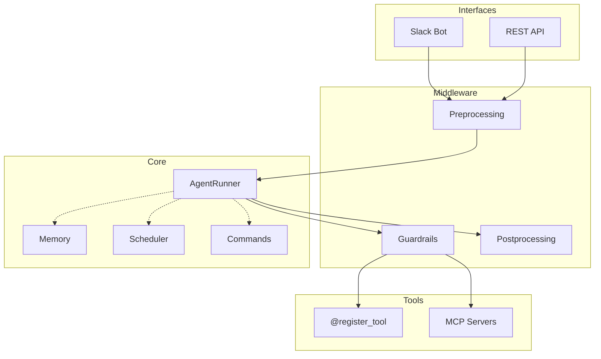

> English | **[한국어](README.ko.md)**

<p align="center">
  
</p>

<h1 align="center">Sidekick</h1>

<p align="center">
  <em>A personal AI agent that remembers you, schedules tasks, and extends with custom tools.</em>
</p>

<p align="center">
  
  
  
  
  
</p>

<p align="center">
  <a href="#quick-start">Quick Start</a> ·
  <a href="#features">Features</a> ·
  <a href="#architecture">Architecture</a> ·
  <a href="AGENTS.md">Dev Guide</a>
</p>

---

## Why Sidekick?

Generic AI chatbots forget you after every conversation, and their capabilities are fixed.

**Sidekick is different** — it remembers your context, runs tasks on a schedule, and you can add any tool with a single function.

| Generic Chatbot | Sidekick |
|-----------------|----------|
| Repeats the same context every time | Remembers past conversations, projects, preferences |
| Real-time chat only | "Remind me in 1 hour" — scheduled tasks |
| Fixed capabilities | Add tools with `@register_tool` |
| Raw prompt input | `!briefing` — custom shortcut commands |

## Quick Start

### One-Line Install

```bash
curl -fsSL https://raw.githubusercontent.com/lee-lou2/sidekick/main/install.sh | bash
```

### Manual Setup

```bash
git clone https://github.com/lee-lou2/sidekick.git
cd sidekick
cp .env.example .env  # Set your GOOGLE_API_KEY
make run              # Auto-installs deps, picks run mode
```

> `make run` handles uv installation, dependencies, and run mode selection automatically.

### Run Modes

**Slack Bot:**
```bash
uv run python src/interfaces/slack/bot.py
```

**REST API:**
```bash
uv run uvicorn src.interfaces.api:app --port 8000
```

**API Example:**
```bash
curl -X POST http://localhost:8000/run \
  -H "Content-Type: application/json" \
  -H "X-API-Key: $API_AUTH_KEY" \
  -d '{
    "prompt": "Summarize today'\''s news",
    "webhook_url": "https://your-server.com/webhook"
  }'
```

## Features

### Memory — An AI That Remembers

```
You:   I'm working on a side project with FastAPI
Agent: What kind of service are you building?

(days later)

You:   My API feels slow
Agent: Your FastAPI project? Usually it's DB queries or sync I/O.
       Want me to profile a specific endpoint?
```

- Automatically remembers names, projects, communication style
- No explicit "remember this" needed — learns naturally
- Per-user isolated memory (multi-user safe)

### Scheduler — Timed Tasks

```
"Summarize today's news in 1 minute"
"Remind me about the meeting at 5 PM"
"Check my email tomorrow at 10 AM"
```

- Parses Korean and English time expressions
- SQLite persistence — survives bot restarts
- `List my scheduled tasks`, `Cancel task abc123`

### Custom Commands

Save frequently-used prompts as shortcut commands:

```
You:   Create a command !briefing with prompt "Summarize top 3 news today"
Agent: Command 'briefing' created!

(later)

You:   !briefing
Agent: [Today's news summary...]
```

- AI auto-improves your prompt
- Recommends relevant tools automatically
- Users can only modify their own commands

### Plug-and-Play Tools

```python
# src/tools/custom/weather.py
import os
from src.tools.registry import register_tool

@register_tool
def get_weather(city: str) -> str:
    """Get the weather for a city."""
    api_key = os.getenv("WEATHER_API_KEY")
    return fetch_weather_api(city, api_key)
```

**Drop a file, restart, done.** No other files to modify.
- Environment variables: add to `.env`
- Restart: `make run`

### Tool Sharing

Share tools with others and install shared tools:

```bash
make tool-upload   # Upload → get a temporary link
make tool-install  # Install from a link → auto-validates Python syntax
```

## Architecture



| Layer | Responsibility | Examples |
|-------|---------------|----------|
| **Interfaces** | Entry points, protocol handling | Slack Socket Mode, FastAPI |
| **Middleware** | Cross-cutting concerns | Security guardrails, preprocessing |
| **Core** | Business logic | Agent, memory, scheduler |
| **Tools** | Tool definitions & execution | Custom functions, MCP servers |

<details>
<summary>Directory Structure</summary>

```
src/
├── interfaces/          # Entry points
│   ├── slack/          # Slack (Socket Mode, lazy listener)
│   └── api/            # FastAPI (async, webhooks)
├── middleware/
│   ├── guardrails/     # Security — sensitive file blocking, write restrictions
│   ├── preprocessing/  # Command parsing, context setup
│   └── postprocessing/ # Response formatting (minimal)
├── core/
│   ├── agent/          # AgentRunner, AgentFactory, utils
│   ├── memory/         # Graph-based user context
│   ├── scheduler/      # APScheduler + SQLite
│   ├── commands/       # Custom command CRUD
│   └── lifecycle.py    # Component start/stop management
├── tools/
│   ├── custom/         # @register_tool functions
│   ├── mcp/            # MCP server definitions (gitignored)
│   ├── mcp_registry.py # MCPServerConfig, register_mcp_server()
│   ├── mcp_client.py   # MCPManager (multi-server connections)
│   ├── catalog.py      # Unified tool catalog
│   └── registry.py     # Auto-registration logic
└── utils/              # Logging, formatters, etc.
```

</details>

### Design Principles

| Principle | Implementation |
|-----------|---------------|
| **Loose Coupling** | Plug-and-play tools/MCP servers — add or remove by file |
| **Defense in Depth** | Guardrails protect all tool types (MCP + custom) |
| **Lifecycle Management** | Singleton components with ordered start/stop |
| **MCP Integration** | Connect filesystem, git, GitHub, and more |
| **Observability** | Pydantic Logfire integration |

## Environment Variables

| Variable | Required | Description |
|----------|:--------:|-------------|
| `GOOGLE_API_KEY` | Yes | Gemini API key |
| `SLACK_BOT_TOKEN` | | Slack bot token |
| `SLACK_APP_TOKEN` | | Slack app token |
| `API_AUTH_KEY` | | REST API auth key (disabled if unset) |
| `GITHUB_TOKEN` | | MCP GitHub integration |

See [.env.example](.env.example) for all core variables. Custom tool variables go in `.env` only.

## Development

```bash
make              # Help
make test         # Core tests
make test-all     # All tests (including custom tools)
make lint         # Lint + auto-fix
make format       # Code formatting
make tool-install # Install external tools
make tool-upload  # Upload tools for sharing
make edit-env     # Edit .env
```

See [AGENTS.md](AGENTS.md) for the full development guide.

## Contributing

Contributions are welcome! Here's how:

1. Fork the repository
2. Create a feature branch (`git checkout -b feature/amazing-feature`)
3. Follow the style guide in [AGENTS.md](AGENTS.md)
4. Run `make lint && make test` before committing
5. Submit a Pull Request

### Adding a Tool

The simplest way to contribute is adding a new tool:

```python
# src/tools/custom/your_tool.py
from src.tools.registry import register_tool

@register_tool
def your_tool(param: str) -> str:
    """What this tool does."""
    return f"Result: {param}"
```

That's it. No other files to modify.

## Limitations

- Tools require a restart after adding
- SQLite-based (single instance recommended)
- Designed for personal / small team use

## License

MIT
