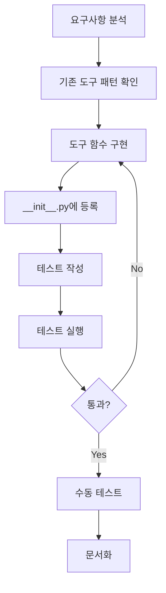
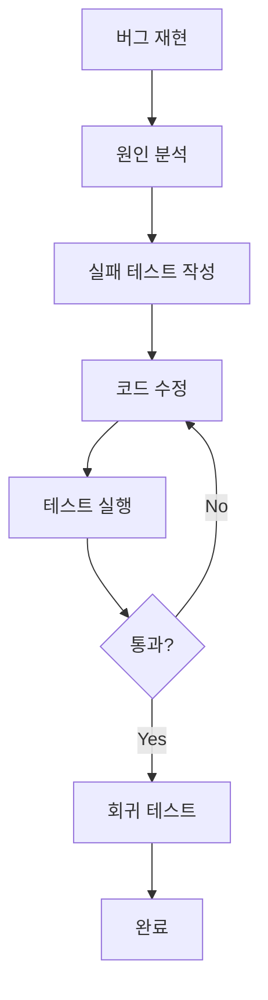
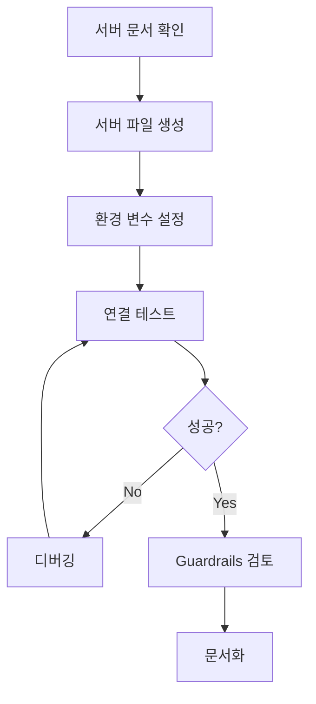
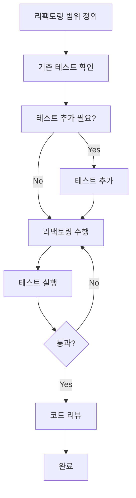

# Development Workflow Guide

AI가 코드 작업을 수행할 때 따라야 하는 계획, 구현, 검증 워크플로우를 정의합니다.

> **Quick Reference**: [CLAUDE.md](../CLAUDE.md) | **Tool Creation**: [TOOL_CREATION_GUIDE.md](./TOOL_CREATION_GUIDE.md) | **MCP**: [MCP_INTEGRATION_GUIDE.md](./MCP_INTEGRATION_GUIDE.md)

---

## Table of Contents

1. [워크플로우 개요](#워크플로우-개요)
2. [Phase 1: 계획](#phase-1-계획)
3. [Phase 2: 구현](#phase-2-구현)
4. [Phase 3: 검증](#phase-3-검증)
5. [Phase 4: 문서화](#phase-4-문서화)
6. [작업 유형별 워크플로우](#작업-유형별-워크플로우)
7. [체크리스트](#체크리스트)

---

## 워크플로우 개요

```
┌─────────────────────────────────────────────────────────────┐
│                    DEVELOPMENT WORKFLOW                      │
├─────────────────────────────────────────────────────────────┤
│                                                              │
│  ┌──────────┐    ┌──────────┐    ┌──────────┐    ┌────────┐│
│  │  PLAN    │───▶│ IMPLEMENT│───▶│  VERIFY  │───▶│  DOC   ││
│  │          │    │          │    │          │    │        ││
│  │ • Scope  │    │ • Code   │    │ • Test   │    │ • API  ││
│  │ • Design │    │ • Style  │    │ • Lint   │    │ • Usage││
│  │ • Risk   │    │ • Types  │    │ • Review │    │ • Update│
│  └──────────┘    └──────────┘    └──────────┘    └────────┘│
│       │              │               │                      │
│       └──────────────┴───────────────┘                      │
│              ▲ Iterate if issues found                      │
└─────────────────────────────────────────────────────────────┘
```

### 원칙

| 원칙 | 설명 |
|------|------|
| **먼저 이해** | 수정 전에 기존 코드를 반드시 읽고 이해 |
| **최소 변경** | 요청된 것만 변경, 불필요한 개선 금지 |
| **점진적 접근** | 한 번에 하나씩, 작은 단위로 작업 |
| **검증 우선** | 모든 변경은 테스트로 검증 |

---

## Phase 1: 계획

### 1.1 요구사항 분석

```markdown
## 요구사항 체크리스트

- [ ] 사용자 요청을 명확히 이해했는가?
- [ ] 모호한 부분이 있으면 질문했는가?
- [ ] 범위(scope)가 명확한가?
- [ ] 제약 조건을 파악했는가?
```

### 1.2 기존 코드 분석

**반드시 수행:**
```bash
# 1. 관련 파일 구조 파악
ls -la src/
ls -la src/tools/

# 2. 관련 코드 읽기
# - 수정할 파일
# - 의존하는 파일
# - 영향 받는 파일

# 3. 기존 패턴 파악
# - 네이밍 컨벤션
# - 에러 처리 방식
# - 테스트 구조
```

### 1.3 설계 결정

```markdown
## 설계 결정 문서

### 문제 정의
[무엇을 해결하려는가?]

### 접근 방식
[어떻게 해결할 것인가?]

### 대안 검토
1. 방식 A: [장점/단점]
2. 방식 B: [장점/단점]
→ 선택: [이유]

### 영향 범위
- 수정 파일: [목록]
- 새 파일: [목록]
- 의존성 변경: [있음/없음]
```

### 1.4 위험 평가

| 위험 수준 | 기준 | 대응 |
|-----------|------|------|
| **Low** | 단일 파일, 새 기능 추가 | 바로 진행 |
| **Medium** | 여러 파일, 기존 로직 수정 | 백업 후 진행 |
| **High** | 핵심 모듈, 파괴적 변경 | 명시적 확인 후 진행 |

---

## Phase 2: 구현

### 2.1 코드 작성 규칙

#### 스타일 가이드 준수

```python
# ✅ GOOD: 프로젝트 스타일 준수
def process_data(input_text: str, max_length: int = 100) -> str:
    """Process input text with length limit.

    Args:
        input_text: Text to process.
        max_length: Maximum output length.

    Returns:
        Processed text string.
    """
    return input_text[:max_length]

# ❌ BAD: 스타일 불일치
def processData(inputText, maxLength=100):
    """process text"""
    return inputText[:maxLength]
```

#### 에러 처리

```python
# ✅ GOOD: 사용자 친화적 에러 메시지
def fetch_data(url: str) -> str:
    if not url.startswith(("http://", "https://")):
        return "Error: URL must start with http:// or https://"

    try:
        response = httpx.get(url, timeout=30)
        response.raise_for_status()
        return response.text
    except httpx.TimeoutException:
        return f"Error: Request timed out for {url}"
    except httpx.HTTPStatusError as e:
        return f"Error: HTTP {e.response.status_code}"
    except Exception as e:
        return f"Error: {str(e)}"

# ❌ BAD: 기술적 에러 그대로 노출
def fetch_data(url: str) -> str:
    response = httpx.get(url)  # 예외 처리 없음
    return response.text
```

#### Import 순서

```python
# 1. 표준 라이브러리
import os
import logging
from datetime import datetime
from typing import Optional, List

# 2. 서드파티
import httpx
from pydantic_ai import Agent, FunctionToolset

# 3. 로컬
from src.core.agent import AgentRunner
from src.tools.registry import register_tool
from src.config import settings
```

### 2.2 변경 최소화

```python
# ❌ BAD: 불필요한 리팩토링 포함
def calculate(a: float, b: float) -> str:
    """Calculate sum of two numbers.

    This function adds two numbers together and returns the result.
    It supports both integers and floating point numbers.

    Args:
        a: First number to add.
        b: Second number to add.

    Returns:
        The sum of a and b as a formatted string.

    Examples:
        >>> calculate(2.0, 3.0)
        'Result: 5.0'
    """
    result = a + b
    return f"Result: {float(result)}"

# ✅ GOOD: 필요한 것만
def calculate(a: float, b: float) -> str:
    """Calculate sum of two numbers.

    Args:
        a: First number.
        b: Second number.

    Returns:
        Sum as formatted string.
    """
    return f"Result: {a + b}"
```

### 2.3 타입 힌트

```python
from typing import Optional, List, Dict, Union, Any

# 기본 타입
def func1(text: str) -> str: ...
def func2(count: int) -> int: ...
def func3(ratio: float) -> float: ...
def func4(flag: bool) -> bool: ...

# 컬렉션
def func5(items: List[str]) -> List[str]: ...
def func6(mapping: Dict[str, int]) -> Dict[str, int]: ...

# Optional
def func7(name: Optional[str] = None) -> str: ...

# Union
def func8(value: Union[str, int]) -> str: ...

# Any (사용 자제)
def func9(data: Any) -> Any: ...
```

---

## Phase 3: 검증

### 3.1 테스트 작성

```python
# tests/test_my_tool.py
import pytest
from src.tools.my_tool import my_function

class TestMyFunction:
    """Tests for my_function."""

    def test_basic_case(self):
        """Test basic functionality."""
        result = my_function("input")
        assert "expected" in result

    def test_edge_case_empty(self):
        """Test with empty input."""
        result = my_function("")
        assert result == ""

    def test_edge_case_special_chars(self):
        """Test with special characters."""
        result = my_function("!@#$%")
        assert "Error" not in result

    def test_error_handling(self):
        """Test error case."""
        result = my_function(None)  # type: ignore
        assert "Error" in result
```

### 3.2 테스트 실행

```bash
# 코어 테스트
uv run pytest tests/ --ignore=tests/custom_tools -v

# 커스텀 도구 테스트
uv run pytest tests/custom_tools/ -v

# 전체 테스트 (코어 + 커스텀 도구)
uv run pytest tests/ -v

# 특정 테스트만
uv run pytest tests/test_my_module.py::TestClass::test_method -v

# 커버리지 포함
uv run pytest tests/ -v --cov=src --cov-report=term-missing
```

### 3.3 린트 및 타입 체크

```bash
# Ruff 린트 (자동 수정 포함)
uv run ruff check src/ tests/ --fix

# 코드 포맷팅
uv run ruff format src/ tests/

# 타입 체크 (선택사항)
uv run mypy src/ --ignore-missing-imports
```

**Ruff 검사 항목:**
- `E`, `W` - PEP 8 스타일
- `F` - Pyflakes (논리적 오류)
- `I` - isort (import 정렬)
- `B` - flake8-bugbear (버그 패턴)
- `UP` - pyupgrade (Python 최신 문법)
- `SIM` - flake8-simplify (코드 단순화)

### 3.4 Pre-commit Hooks

Git 커밋 전에 자동으로 코드 품질을 검사합니다.

```bash
# Hook 설치 (최초 1회)
uv run pre-commit install

# 수동 실행 (모든 파일)
uv run pre-commit run --all-files

# 특정 hook만 실행
uv run pre-commit run ruff --all-files
uv run pre-commit run ruff-format --all-files
```

**포함된 Hook:**
| Hook | 설명 |
|------|------|
| `ruff` | Lint 검사 + 자동 수정 |
| `ruff-format` | 코드 포맷팅 |
| `trailing-whitespace` | 줄 끝 공백 제거 |
| `end-of-file-fixer` | 파일 끝 개행 추가 |
| `check-yaml/json/toml` | 설정 파일 문법 검사 |
| `debug-statements` | print/debugger 문 감지 |
| `detect-private-key` | 비밀키 노출 방지 |

**커밋 시 자동 실행:**
```bash
git commit -m "Your message"
# → pre-commit hooks 자동 실행
# → 실패 시 커밋 중단

# Hook이 파일을 수정한 경우:
git add -A
git commit -m "Your message"  # 다시 커밋
```

### 3.5 수동 검증

```python
# 대화형 테스트
uv run python -c "
from src.tools.custom.my_tool import my_function
result = my_function('test input')
print(f'Result: {result}')
"

# 에이전트와 통합 테스트
uv run python -c "
from src.core.agent import AgentRunner

with AgentRunner() as agent:
    result = agent.run('Use my_function with input hello')
    print(result.output)
"
```

### 3.6 검증 체크리스트

```markdown
## 검증 체크리스트

### 코드 품질
- [ ] 타입 힌트 완전
- [ ] docstring 작성
- [ ] 에러 처리 완료
- [ ] 불필요한 코드 없음

### Lint & Format
- [ ] `uv run ruff check src/ tests/` 통과
- [ ] `uv run ruff format src/ tests/` 실행
- [ ] Import 순서 정렬됨

### 테스트
- [ ] 기본 케이스 테스트
- [ ] 엣지 케이스 테스트
- [ ] 에러 케이스 테스트
- [ ] 모든 테스트 통과

### 통합
- [ ] 기존 테스트 영향 없음
- [ ] pre-commit hooks 통과
- [ ] 수동 테스트 완료
```

---

## Phase 4: 문서화

### 4.1 코드 문서

```python
def my_tool(param: str) -> str:
    """Brief description of the tool.

    Detailed description explaining what the tool does,
    when to use it, and any important notes.

    Args:
        param: Description of the parameter.

    Returns:
        Description of what is returned.

    Example:
        >>> result = my_tool("input")
        >>> print(result)
    """
```

### 4.2 변경 사항 요약

변경 완료 후 다음 정보 제공:

```markdown
## 변경 사항 요약

### 추가된 파일
- `src/tools/new_tool.py`: 새 도구 구현

### 수정된 파일
- `src/tools/__init__.py`: 새 도구 등록
- `src/agent/core.py`: 에러 처리 개선

### 테스트
- `tests/test_new_tool.py`: 새 도구 테스트

### 실행 방법
```bash
uv run pytest tests/test_new_tool.py -v
```

### 주의 사항
- 환경 변수 `NEW_API_KEY` 필요
```

### 4.3 CLAUDE.md/AGENTS.md 업데이트

새 도구나 중요한 패턴 추가 시:

```markdown
# CLAUDE.md 업데이트 필요 여부 체크리스트

- [ ] 새 MCP 서버 추가됨
- [ ] 새 환경 변수 필요
- [ ] 주요 아키텍처 변경
- [ ] 새 명령어/워크플로우 추가
```

---

## 작업 유형별 워크플로우

### A. 새 도구 추가



**단계:**
1. `src/tools/custom/` 내 기존 도구 패턴 확인
2. `src/tools/custom/new_tool.py` 작성 (`@register_tool` 사용)
3. `tests/custom_tools/test_new_tool.py` 작성
4. 테스트 실행 및 수정
5. 필요시 CLAUDE.md 업데이트

**Note:** `@register_tool` 데코레이터 사용 시 `__init__.py` 수정 불필요!

### B. 버그 수정



**단계:**
1. 버그 재현 방법 확인
2. 관련 코드 읽기 및 원인 파악
3. 버그를 재현하는 테스트 작성
4. 최소한의 수정으로 버그 해결
5. 기존 테스트 모두 통과 확인

### C. MCP 서버 추가



**단계:**
1. MCP 서버 문서 및 도구 목록 확인
2. `src/tools/mcp/my_server.py` 생성 (`register_mcp_server()` 호출)
3. `.env`에 환경 변수 추가
4. 연결 및 도구 테스트
5. 상세 가이드: [MCP_SERVER_GUIDE.md](./MCP_SERVER_GUIDE.md)

### D. 리팩토링



**단계:**
1. 리팩토링 범위와 목표 명확화
2. 기존 테스트 커버리지 확인
3. 필요시 테스트 추가
4. 점진적으로 리팩토링 수행
5. 매 단계마다 테스트 실행

---

## 체크리스트

### 작업 시작 전

```markdown
## 시작 전 체크리스트

- [ ] 요구사항 명확히 이해
- [ ] 관련 코드 모두 읽음
- [ ] 영향 범위 파악
- [ ] 기존 테스트 실행하여 baseline 확인
```

### 구현 중

```markdown
## 구현 체크리스트

- [ ] 프로젝트 스타일 가이드 준수
- [ ] 타입 힌트 완전
- [ ] docstring 작성
- [ ] 에러 처리 완료
- [ ] 불필요한 변경 없음
```

### 완료 전

```markdown
## 완료 체크리스트

- [ ] 모든 테스트 통과
- [ ] 린트 에러 없음
- [ ] 수동 테스트 완료
- [ ] 문서 업데이트 (필요시)
- [ ] 변경 사항 요약 제공
```

---

## 명령어 요약

```bash
# 의존성 설치
uv sync

# 코어 테스트
uv run pytest tests/ --ignore=tests/custom_tools -v

# 전체 테스트 (커스텀 도구 포함)
uv run pytest tests/ -v

# 특정 테스트
uv run pytest tests/test_file.py::TestClass::test_method -v

# 커버리지
uv run pytest tests/ -v --cov=src

# 린트 & 포맷
uv run ruff check src/ tests/ --fix  # Lint + 자동 수정
uv run ruff format src/ tests/        # 코드 포맷팅

# Pre-commit hooks
uv run pre-commit install            # Hook 설치 (최초 1회)
uv run pre-commit run --all-files    # 수동 실행

# 에이전트 실행
uv run python -c "
from src.core.agent import AgentRunner
with AgentRunner(enable_mcp=True) as agent:
    result = agent.run('your task here')
    print(result.output)
"

# Slack 봇 실행
uv run python src/interfaces/slack/bot.py

# API 서버 실행
uv run uvicorn src.interfaces.api.main:app --port 8000 --reload
```

---

**Last Updated**: 2026-02-04
